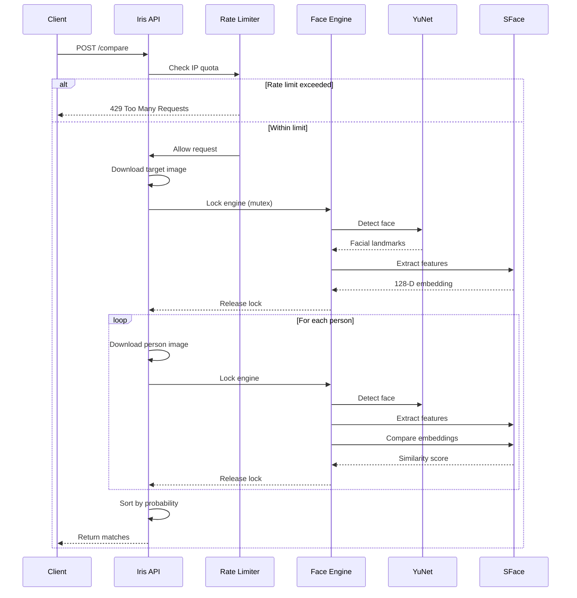

## What is Iris?

Iris is a **stateless, high-performance face recognition API** built in Rust, designed specifically for hospital IT systems to identify unresponsive patients in real-time. By comparing emergency captures against secure patient databases, Iris provides sub-100ms inference times while maintaining absolute privacy through zero-persistence architecture.

<Note>
  Iris is infrastructure, not storage. It returns mathematical similarity scores between images, allowing hospitals to link results to their own secure Electronic Medical Record (EMR) systems.
</Note>

## Key Use Cases

Iris excels in scenarios where rapid, privacy-conscious biometric identification is critical:

<CardGroup cols={2}>
  <Card title="Emergency Patient Identification" icon="hospital">
    Identify unconscious or unresponsive patients in emergency departments by comparing their face against the hospital's patient database.
  </Card>
  
  <Card title="Medical Record Linking" icon="link">
    Match patients to their correct medical records when traditional identification methods (ID cards, verbal confirmation) are unavailable.
  </Card>
  
  <Card title="Cross-Department Verification" icon="building">
    Verify patient identity during transfers between departments, ensuring continuity of care and reducing medical errors.
  </Card>
  
  <Card title="Access Control Integration" icon="shield">
    Integrate with secure area access systems for authorized personnel or patient verification in restricted zones.
  </Card>
</CardGroup>

## Core Architecture

Iris is built on three fundamental principles that make it suitable for healthcare environments:

### 1. Stateless Processing

Every image is processed entirely in volatile memory (RAM) and destroyed immediately after feature extraction. The workflow:

<Steps>
  <Step title="Image Download">
    Images are fetched from URLs or decoded from Base64 data URIs directly into RAM
    
    ```rust
    // From main.rs:47-60
    async fn download_and_decode(url: &str) -> Result<Mat> {
        let bytes: Vec<u8> = if url.starts_with("data:") {
            // Decode Base64 data URI
            let comma = url.find(',').ok_or_else(|| anyhow!("Invalid data URI"))?;
            general_purpose::STANDARD.decode(&url[comma + 1..])?;
        } else {
            // Download from URL
            let client = reqwest::Client::builder().user_agent("IrisAPI/1.0").build()?;
            let response = client.get(url).send().await?;
            response.bytes().await?.to_vec()
        };
        // Decode image directly into OpenCV Mat structure
        let vector_uint8 = core::Vector::<u8>::from_iter(bytes);
        let img = imgcodecs::imdecode(&vector_uint8, imgcodecs::IMREAD_COLOR)?;
        Ok(img)
    }
    ```
  </Step>
  
  <Step title="Face Detection">
    YuNet model detects faces and extracts facial landmarks in the image
    
    ```rust
    // From face.rs:26-28
    det.set_input_size(img.size())?;
    let mut faces = Mat::default();
    det.detect(img, &mut faces)?;
    ```
  </Step>
  
  <Step title="Feature Extraction">
    SFace model generates a 128-dimensional feature vector representing the face
    
    ```rust
    // From face.rs:30-36
    if faces.rows() > 0 {
        let face_data = faces.row(0)?;
        let mut aligned = Mat::default();
        rec.align_crop(img, &face_data, &mut aligned)?;
        let mut feature = Mat::default();
        rec.feature(&aligned, &mut feature)?;
    }
    ```
  </Step>
  
  <Step title="Similarity Comparison">
    Feature vectors are compared using cosine similarity, producing a match score
    
    ```rust
    // From main.rs:103-109
    if let Ok(Some(p_emb)) = get_embedding(&p_img, det, rec) {
        let score = rec.match_(&t_emb, &p_emb, 
            objdetect::FaceRecognizerSF_DisType::FR_COSINE as i32)?;
        if score > 0.363 {  // Threshold for positive match
            results.push(MatchResult { name: person.name, probability: score * 100.0 });
        }
    }
    ```
  </Step>
  
  <Step title="Memory Cleanup">
    All image data and feature vectors are destroyed when they go out of scope—no persistence
  </Step>
</Steps>

<Warning>
  Iris **never** writes biometric data to disk. All processing happens in RAM, and data is automatically cleaned up by Rust's ownership system.
</Warning>

### 2. ONNX-Accelerated Models

Iris uses two pre-trained neural networks from OpenCV Zoo:

<AccordionGroup>
  <Accordion title="YuNet - Face Detection" icon="eye">
    **Model:** `face_detection_yunet_2023mar.onnx`
    
    **Purpose:** Detects faces in images and extracts 5-point facial landmarks (eyes, nose, mouth corners)
    
    **Performance:** Processes 320×320 images with confidence threshold of 0.9
    
    **Configuration:**
    ```rust
    // From face.rs:11-13
    let detector = objdetect::FaceDetectorYN::create(
        "face_detection_yunet_2023mar.onnx", 
        "", 
        core::Size::new(320, 320),  // Input size
        0.9,   // Score threshold
        0.3,   // NMS threshold
        5000,  // Top K
        0, 0
    )?;
    ```
  </Accordion>
  
  <Accordion title="SFace - Face Recognition" icon="fingerprint">
    **Model:** `face_recognition_sface_2021dec.onnx`
    
    **Purpose:** Generates 128-dimensional feature embeddings from aligned face crops
    
    **Performance:** Produces embeddings that enable sub-100ms comparison times
    
    **Match Threshold:** Cosine similarity score > 0.363 indicates a positive match
    
    **Configuration:**
    ```rust
    // From face.rs:14-16
    let recognizer = objdetect::FaceRecognizerSF::create(
        "face_recognition_sface_2021dec.onnx", 
        "", 
        0, 0
    )?;
    ```
  </Accordion>
</AccordionGroup>

### 3. Rust Performance

Built with Rust for memory safety and performance:

- **Zero-cost abstractions:** No runtime overhead for safety guarantees
- **Ownership system:** Automatic memory cleanup without garbage collection
- **Async runtime:** Tokio-powered concurrency for handling multiple requests
- **Type safety:** Compile-time guarantees prevent common programming errors

## API Design

Iris provides a minimal REST API with three endpoints:

<CardGroup cols={3}>
  <Card title="POST /compare" icon="scale-balanced" href="/api/compare">
    Compare a target face against a list of people
  </Card>
  
  <Card title="GET /stats" icon="chart-simple" href="/api/stats">
    Retrieve API usage statistics
  </Card>
  
  <Card title="GET /health" icon="heart-pulse" href="/api/health">
    Check API health status
  </Card>
</CardGroup>

### Request Flow

Here's how a typical comparison request flows through the system:



<Info>
  The Face Engine uses a mutex to ensure thread-safe access to the ONNX models, processing one face at a time while maintaining high throughput.
</Info>

## Security & Privacy

Iris is designed with healthcare data privacy regulations in mind:

<CardGroup cols={2}>
  <Card title="Zero Persistence" icon="trash">
    Images processed in RAM only—no disk writes, no logs, no retention
  </Card>
  
  <Card title="Rate Limiting" icon="gauge-high">
    5 requests/second per IP with burst capacity of 10
  </Card>
  
  <Card title="CORS Enabled" icon="globe">
    Configurable CORS for secure frontend integration
  </Card>
  
  <Card title="No PII Storage" icon="database">
    Returns only similarity scores—hospitals maintain their own EMR data
  </Card>
</CardGroup>

### Match Threshold

The default threshold of **0.363** for cosine similarity is based on SFace model recommendations:

- **Score > 0.363:** Positive match (same person)
- **Score ≤ 0.363:** No match (different people)

```rust
// From main.rs:104
if score > 0.363 {
    results.push(MatchResult {
        name: person.name,
        probability: (score * 100.0).round(),
    });
}
```

<Tip>
  In production, you may want to adjust this threshold based on your specific accuracy requirements and false positive tolerance.
</Tip>

## Deployment Options

Iris can be deployed in multiple configurations:

1. **Local Development:** Run directly with `cargo run --release`
2. **Docker Container:** Deploy as a containerized service (see Dockerfile)
3. **Kubernetes:** Scale horizontally with multiple replicas
4. **On-Premise:** Install on hospital infrastructure for data sovereignty

## Next Steps

<CardGroup cols={2}>
  <Card title="Quickstart Guide" icon="rocket" href="/quickstart">
    Get Iris running locally in 5 minutes
  </Card>
  
  <Card title="API Reference" icon="code" href="/api/compare">
    Explore the complete API documentation
  </Card>
  
  <Card title="Architecture Deep Dive" icon="diagram-project" href="/concepts/architecture">
    Learn about Iris's internal design
  </Card>
  
  <Card title="Docker Deployment" icon="docker" href="/setup/docker">
    Deploy Iris in production environments
  </Card>
</CardGroup>
