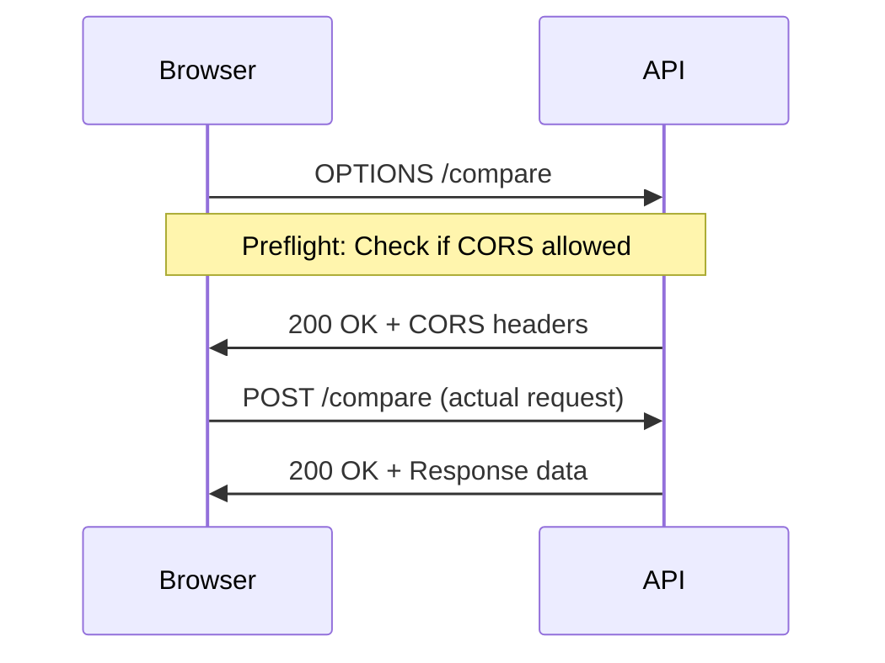

## Overview

Iris implements **Cross-Origin Resource Sharing (CORS)** using the `tower-http` crate to enable browser-based applications to make requests to the API from different origins. The default configuration is permissive to support development and flexible deployments.

<Warning>
The default CORS configuration allows requests from **any origin**. This is suitable for development but should be restricted in production environments.
</Warning>

## Current CORS Configuration

### Default Settings

The API is configured with the following CORS policy:

```rust
// From main.rs:138-141
let cors = CorsLayer::new()
    .allow_origin(Any)
    .allow_methods([Method::POST, Method::GET])
    .allow_headers([header::CONTENT_TYPE]);
```

**Policy details:**
- **Allowed Origins**: `*` (any origin)
- **Allowed Methods**: `POST`, `GET`
- **Allowed Headers**: `Content-Type`
- **Credentials**: Not allowed (default)
- **Max Age**: Not set (browser default)

### Layer Application

CORS is applied globally to all routes:

```rust
// From main.rs:143-149
let app = Router::new()
    .route("/compare", post(handle_compare))
    .route("/stats", get(handle_stats))
    .route("/health", get(|| async { "OK" }))
    .layer(middleware::from_fn_with_state(state.clone(), rate_limit_middleware))
    .layer(cors)  // CORS layer applied here
    .with_state(state);
```

<Info>
The CORS layer processes requests after rate limiting. Rate-limited requests return 429 before CORS headers are added.
</Info>

## How CORS Works

### Preflight Requests

For cross-origin POST requests with JSON, browsers send a preflight OPTIONS request:



### CORS Headers in Response

When configured with `allow_origin(Any)`, responses include:

```http
Access-Control-Allow-Origin: *
Access-Control-Allow-Methods: POST, GET
Access-Control-Allow-Headers: content-type
```

### Example Browser Request

```javascript
// This works with default CORS configuration
fetch('http://localhost:8080/compare', {
  method: 'POST',
  headers: {
    'Content-Type': 'application/json'
  },
  body: JSON.stringify({
    target_url: 'https://example.com/target.jpg',
    people: [
      {
        name: 'John Doe',
        image_url: 'https://example.com/john.jpg'
      }
    ]
  })
})
.then(response => response.json())
.then(data => console.log(data));
```

## Restricting CORS in Production

### Allow Specific Origins

For production deployments, restrict access to known domains:

```rust
use tower_http::cors::{CorsLayer, AllowOrigin};
use axum::http::HeaderValue;

// Allow only your frontend domain
let cors = CorsLayer::new()
    .allow_origin("https://yourdomain.com".parse::<HeaderValue>().unwrap())
    .allow_methods([Method::POST, Method::GET])
    .allow_headers([header::CONTENT_TYPE]);
```

### Allow Multiple Specific Origins

```rust
let allowed_origins = [
    "https://yourdomain.com".parse::<HeaderValue>().unwrap(),
    "https://app.yourdomain.com".parse::<HeaderValue>().unwrap(),
    "https://staging.yourdomain.com".parse::<HeaderValue>().unwrap(),
];

let cors = CorsLayer::new()
    .allow_origin(allowed_origins)
    .allow_methods([Method::POST, Method::GET])
    .allow_headers([header::CONTENT_TYPE]);
```

### Dynamic Origin Validation

For more complex scenarios, validate origins dynamically:

```rust
use tower_http::cors::AllowOrigin;

let cors = CorsLayer::new()
    .allow_origin(AllowOrigin::predicate(|origin: &HeaderValue, _| {
        origin.as_bytes().ends_with(b".yourdomain.com")
            || origin.as_bytes() == b"https://yourdomain.com"
    }))
    .allow_methods([Method::POST, Method::GET])
    .allow_headers([header::CONTENT_TYPE]);
```

<Note>
Dynamic validation runs on every request, so keep the predicate function lightweight.
</Note>

## Advanced CORS Configuration

### Allow Credentials

If your API uses cookies or authentication:

```rust
let cors = CorsLayer::new()
    .allow_origin("https://yourdomain.com".parse::<HeaderValue>().unwrap())
    .allow_methods([Method::POST, Method::GET])
    .allow_headers([header::CONTENT_TYPE, header::AUTHORIZATION])
    .allow_credentials(true);  // Enable credentials
```

<Warning>
When `allow_credentials(true)` is set, you **cannot** use `allow_origin(Any)`. You must specify exact origins.
</Warning>

**Browser behavior with credentials:**

```javascript
fetch('http://localhost:8080/compare', {
  method: 'POST',
  headers: {
    'Content-Type': 'application/json',
    'Authorization': 'Bearer token123'
  },
  credentials: 'include',  // Send cookies/auth
  body: JSON.stringify({...})
})
```

### Expose Custom Headers

If you add custom response headers that browsers should access:

```rust
let cors = CorsLayer::new()
    .allow_origin(Any)
    .allow_methods([Method::POST, Method::GET])
    .allow_headers([header::CONTENT_TYPE])
    .expose_headers(["X-Request-Id", "X-RateLimit-Remaining"]);
```

Now JavaScript can read these headers:

```javascript
fetch('http://localhost:8080/compare', {...})
  .then(response => {
    console.log(response.headers.get('X-Request-Id'));
    console.log(response.headers.get('X-RateLimit-Remaining'));
  });
```

### Set Max Age for Preflight Cache

Reduce preflight requests by caching the CORS policy:

```rust
use std::time::Duration;

let cors = CorsLayer::new()
    .allow_origin(Any)
    .allow_methods([Method::POST, Method::GET])
    .allow_headers([header::CONTENT_TYPE])
    .max_age(Duration::from_secs(3600));  // Cache for 1 hour
```

Browsers will skip preflight requests for the same origin/method/headers combination for 1 hour.

### Allow Additional Methods

If you add new endpoints with different HTTP methods:

```rust
let cors = CorsLayer::new()
    .allow_origin(Any)
    .allow_methods([Method::POST, Method::GET, Method::PUT, Method::DELETE])
    .allow_headers([header::CONTENT_TYPE]);
```

### Allow Additional Headers

If clients need to send custom headers:

```rust
let cors = CorsLayer::new()
    .allow_origin(Any)
    .allow_methods([Method::POST, Method::GET])
    .allow_headers([
        header::CONTENT_TYPE,
        header::AUTHORIZATION,
        HeaderName::from_static("x-api-key"),
        HeaderName::from_static("x-request-id"),
    ]);
```

## Environment-Based Configuration

Use different CORS settings for development vs. production:

```rust
use std::env;

let cors = if env::var("ENVIRONMENT").unwrap_or_default() == "production" {
    // Production: strict CORS
    CorsLayer::new()
        .allow_origin("https://yourdomain.com".parse::<HeaderValue>().unwrap())
        .allow_methods([Method::POST, Method::GET])
        .allow_headers([header::CONTENT_TYPE])
        .allow_credentials(true)
} else {
    // Development: permissive CORS
    CorsLayer::new()
        .allow_origin(Any)
        .allow_methods([Method::POST, Method::GET, Method::OPTIONS])
        .allow_headers([header::CONTENT_TYPE])
};
```

Set the environment variable:

```bash
# Development
ENVIRONMENT=development cargo run

# Production
ENVIRONMENT=production cargo run
```

## Troubleshooting CORS Errors

### Common Error Messages

#### "No 'Access-Control-Allow-Origin' header"

**Cause**: CORS layer not configured or not applied.

**Solution**: Ensure the CORS layer is added to your router:
```rust
let app = Router::new()
    .route("/compare", post(handle_compare))
    .layer(cors);  // Must be present
```

#### "Origin not allowed by CORS"

**Cause**: Origin is not in the allowed origins list.

**Solution**: Add the origin to `allow_origin()`:
```rust
let cors = CorsLayer::new()
    .allow_origin("https://yourfrontend.com".parse::<HeaderValue>().unwrap())
    // ...
```

#### "Method not allowed by CORS"

**Cause**: HTTP method not in allowed methods.

**Solution**: Add the method:
```rust
let cors = CorsLayer::new()
    .allow_methods([Method::POST, Method::GET, Method::PUT])
    // ...
```

#### "Header not allowed by CORS"

**Cause**: Custom header not in allowed headers.

**Solution**: Add the header:
```rust
let cors = CorsLayer::new()
    .allow_headers([header::CONTENT_TYPE, header::AUTHORIZATION])
    // ...
```

### Testing CORS with curl

#### Simulate Preflight Request

```bash
curl -X OPTIONS http://localhost:8080/compare \
  -H "Origin: https://example.com" \
  -H "Access-Control-Request-Method: POST" \
  -H "Access-Control-Request-Headers: Content-Type" \
  -v
```

**Expected response headers:**
```http
HTTP/1.1 200 OK
access-control-allow-origin: *
access-control-allow-methods: POST, GET
access-control-allow-headers: content-type
```

#### Simulate Actual Request

```bash
curl -X POST http://localhost:8080/compare \
  -H "Origin: https://example.com" \
  -H "Content-Type: application/json" \
  -d '{"target_url": "https://example.com/face.jpg", "people": []}' \
  -v
```

**Expected response headers:**
```http
HTTP/1.1 200 OK
access-control-allow-origin: *
content-type: application/json
```

### Browser DevTools Inspection

1. Open browser DevTools (F12)
2. Go to Network tab
3. Make a request from your web app
4. Click on the request
5. Check the "Headers" section for:
   - **Request Headers**: `Origin`, `Access-Control-Request-Method`
   - **Response Headers**: `Access-Control-Allow-Origin`, etc.

## Security Considerations

### CORS Is Not a Security Feature

<Warning>
CORS **only** protects browsers from making unauthorized requests. It does NOT prevent:
- curl, Postman, or other non-browser clients
- Server-to-server requests
- Attacks from malicious browser extensions
</Warning>

For actual security, implement:
- **Authentication**: API keys, JWT tokens, OAuth
- **Authorization**: Validate user permissions
- **Rate limiting**: Prevent abuse (already implemented)
- **Input validation**: Sanitize all inputs

### Same-Origin Policy Bypass

CORS explicitly relaxes the Same-Origin Policy. Only allow origins you trust:

```rust
// Bad: Allows any origin (current default)
let cors = CorsLayer::new().allow_origin(Any);

// Good: Allows only trusted origins
let cors = CorsLayer::new()
    .allow_origin("https://yourdomain.com".parse::<HeaderValue>().unwrap());
```

### Credential Leakage

If allowing credentials, never use wildcard origins:

```rust
// Dangerous: Exposes credentials to any origin
let cors = CorsLayer::new()
    .allow_origin(Any)
    .allow_credentials(true);  // ❌ This won't work anyway

// Safe: Credentials only sent to specific origin
let cors = CorsLayer::new()
    .allow_origin("https://yourdomain.com".parse::<HeaderValue>().unwrap())
    .allow_credentials(true);  // ✅ Safe
```

## Reverse Proxy CORS Handling

Alternatively, handle CORS at the reverse proxy level:

### Nginx

```nginx
location / {
    if ($request_method = 'OPTIONS') {
        add_header 'Access-Control-Allow-Origin' 'https://yourdomain.com';
        add_header 'Access-Control-Allow-Methods' 'GET, POST, OPTIONS';
        add_header 'Access-Control-Allow-Headers' 'Content-Type';
        add_header 'Content-Length' 0;
        add_header 'Content-Type' 'text/plain';
        return 204;
    }

    add_header 'Access-Control-Allow-Origin' 'https://yourdomain.com' always;
    proxy_pass http://localhost:8080;
}
```

Then remove CORS from Iris:

```rust
let app = Router::new()
    .route("/compare", post(handle_compare))
    // No .layer(cors) - handled by nginx
    .with_state(state);
```

### Cloudflare

Cloudflare can add CORS headers automatically:

1. Go to Cloudflare dashboard
2. Navigate to **Rules** → **Transform Rules**
3. Create a response header modification rule
4. Add headers:
   - `Access-Control-Allow-Origin: https://yourdomain.com`
   - `Access-Control-Allow-Methods: GET, POST`

## Performance Impact

CORS headers add minimal overhead:

- **Preflight requests**: ~1-2ms (cached by browser)
- **Header processing**: ~10-50 microseconds per request
- **Memory**: Negligible

<Info>
Using `max_age()` significantly reduces preflight requests, improving performance for browser clients.
</Info>

## Frequently Asked Questions

**Q: Do I need CORS for server-to-server requests?**

A: No. CORS only affects browser requests. Server-side HTTP clients ignore CORS entirely.

**Q: Why does my OPTIONS request return 404?**

A: Ensure the CORS layer is applied. Axum's CORS layer automatically handles OPTIONS requests.

**Q: Can I disable CORS entirely?**

A: Yes, simply don't add the CORS layer. However, browser-based clients won't be able to make requests.

**Q: Should I use `allow_origin(Any)` in production?**

A: No. Always restrict origins in production to prevent unauthorized access from malicious websites.

**Q: How do I allow localhost during development?**

```rust
let cors = CorsLayer::new()
    .allow_origin([
        "http://localhost:3000".parse::<HeaderValue>().unwrap(),
        "http://localhost:5173".parse::<HeaderValue>().unwrap(),  // Vite default
    ])
    .allow_methods([Method::POST, Method::GET])
    .allow_headers([header::CONTENT_TYPE]);
```

## Related Documentation

- [Privacy Model](/security/privacy-model) - Data handling and privacy guarantees
- [Rate Limiting](/security/rate-limiting) - Request rate controls
- [Docker Deployment](/setup/docker) - Production deployment considerations