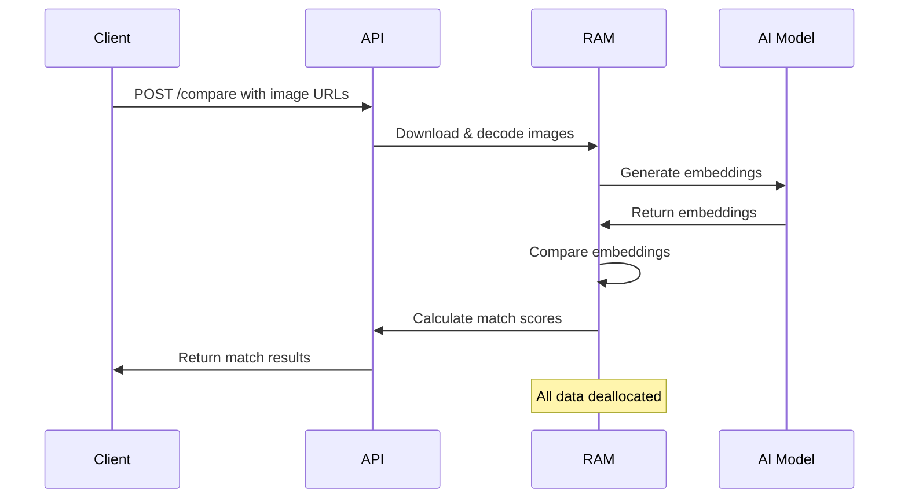

## Overview

Iris implements a **zero-persistence privacy model** designed to process facial recognition requests without storing any user data, biometric information, or personally identifiable information (PII). All processing happens entirely in RAM with no database or filesystem storage.

## Core Privacy Principles

### 1. Zero Data Persistence

Iris does not store any data beyond the lifecycle of a single API request:

- **No database**: The application has no database connection or storage backend
- **No file storage**: Images are never written to disk
- **No logging of PII**: Request logs contain no facial data, embeddings, or user identifiers
- **In-memory only**: All processing occurs in RAM and is discarded immediately after response

<Note>
The only persistent data is aggregate statistics (request counts) with no user-identifiable information.
</Note>

### 2. Ephemeral Image Processing

Images are processed transiently and never retained:

```rust
// From main.rs:47-60
async fn download_and_decode(url: &str) -> Result<Mat> {
    let bytes: Vec<u8> = if url.starts_with("data:") {
        let comma = url.find(',').ok_or_else(|| anyhow!("Invalid data URI"))?;
        general_purpose::STANDARD.decode(&url[comma + 1..])?;
    } else {
        let client = reqwest::Client::builder().user_agent("IrisAPI/1.0").build()?;
        let response = client.get(url).send().await?;
        response.bytes().await?.to_vec()
    };
    let vector_uint8 = core::Vector::<u8>::from_iter(bytes);
    let img = imgcodecs::imdecode(&vector_uint8, imgcodecs::IMREAD_COLOR)?;
    if img.empty() { return Err(anyhow!("Empty image")); }
    Ok(img)
}
```

**Privacy characteristics:**
- Images are decoded directly from HTTP responses or data URIs into memory
- OpenCV `Mat` objects exist only for the duration of the request
- Rust's ownership system ensures automatic memory cleanup when variables go out of scope
- No temporary files are created during decoding

### 3. Biometric Embedding Lifecycle

Facial embeddings (the numerical representation of faces) are never stored:

```rust
// From main.rs:73-85 - Embeddings exist only in request scope
let mut target_embedding: Option<Mat> = None;
{
    let mut guard = state.engine.lock().await;
    let (det, rec) = unsafe {
        (
            &mut *(guard.detector.as_raw_mut() as *mut objdetect::FaceDetectorYN),
            &mut *(guard.recognizer.as_raw_mut() as *mut objdetect::FaceRecognizerSF)
        )
    };
    if let Ok(Some(emb)) = get_embedding(&target_img, det, rec) {
        target_embedding = Some(emb);
    }
}
```

**Embedding privacy:**
- Embeddings are stored only in local function variables
- They are deallocated immediately when the function returns
- No embeddings are passed outside the request handler
- The comparison score is computed and returned, but embeddings are discarded

<Warning>
While Iris doesn't store data, users submitting images to the API should ensure they have appropriate consent and legal basis for facial recognition operations.
</Warning>

## Data Flow Diagram



## What Gets Processed vs. Stored

| Data Type | Processing | Storage | Retention |
|-----------|-----------|---------|----------|
| Input images | ✅ Yes (in RAM) | ❌ No | Request duration only |
| Facial embeddings | ✅ Yes (in RAM) | ❌ No | Request duration only |
| Match scores | ✅ Yes (computed) | ❌ No | Returned in response only |
| Person names | ✅ Yes (passed through) | ❌ No | Request duration only |
| IP addresses | ✅ Yes (rate limiting) | ❌ No | ~1 second (rate limit window) |
| Request counts | ✅ Yes (aggregated) | ✅ Yes | In-memory statistics only |

## Application State

The only persistent state in the application:

```rust
// From main.rs:28-33
#[derive(Clone)]
struct AppState {
    engine: Arc<Mutex<FaceEngine>>,     // AI models (no user data)
    limiter: SharedRateLimiter,          // Rate limit counters (IP -> count)
    stats: RequestStats,                 // Aggregate request counts
}
```

- **`engine`**: Contains only the pre-trained AI models (static, no user data)
- **`limiter`**: Tracks request counts per IP for rate limiting (automatically expires)
- **`stats`**: Aggregate statistics with no user-identifiable information

<Info>
The rate limiter stores IP addresses temporarily in memory to enforce rate limits, but these are automatically pruned and not associated with any request content.
</Info>

## Privacy by Design Features

### Automatic Memory Management

Rust's ownership system provides compile-time guarantees:

```rust
// When target_embedding goes out of scope, memory is freed
let Some(t_emb) = target_embedding else {
    return Json(CompareResponse { matches: vec![] });
};
// t_emb is automatically deallocated at end of function
```

### No PII in Request Logs

The API accepts only:
- Image URLs or data URIs (external references, not logged)
- Display names (user-provided labels, not logged)

No sensitive data appears in application logs.

### Stateless Request Processing

Each request is completely independent:
- No session state between requests
- No user accounts or authentication (can be added separately)
- No request history or analytics per user

## Compliance Considerations

<Warning>
**Deployment Responsibility**: While Iris itself stores no data, you are responsible for:
- Ensuring your web server logs don't capture sensitive data
- Implementing appropriate TLS/HTTPS encryption
- Complying with GDPR, CCPA, BIPA, and other privacy regulations
- Obtaining proper consent before processing facial images
- Implementing your own audit logging if required by regulation
</Warning>

### GDPR Compliance

- **Data Minimization**: ✅ Only processes data necessary for comparison
- **Storage Limitation**: ✅ No data retained beyond request processing
- **Right to Erasure**: ✅ N/A (no data stored)
- **Data Portability**: ✅ N/A (no data stored)

### BIPA Compliance (Illinois Biometric Privacy Act)

- **Biometric Storage**: ✅ No biometric identifiers stored
- **Retention Policy**: ✅ Immediate deletion (end of request)
- **Written Policy**: ⚠️ You must provide consent and policy to end users

## Verifying Privacy Claims

You can verify Iris's privacy model by:

1. **Reviewing the source code**: All code is open source on GitHub
2. **Network analysis**: Monitor network traffic - only image downloads occur
3. **File system monitoring**: Watch for file writes - none occur during processing
4. **Memory profiling**: Observe memory release after requests complete

## Comparison with Cloud Services

| Feature | Iris (Self-Hosted) | Typical Cloud API |
|---------|-------------------|------------------|
| Data storage | ❌ None | ✅ Often stored for "service improvement" |
| Third-party access | ❌ Impossible | ⚠️ Vendor has access |
| Data residency | ✅ Your server | ❌ Vendor's datacenter |
| Privacy control | ✅ Complete | ⚠️ Limited by ToS |
| Audit transparency | ✅ Full source access | ❌ Black box |

## Best Practices for Deployers

1. **Deploy behind HTTPS** to encrypt image data in transit
2. **Configure reverse proxy logging** to exclude request bodies
3. **Implement authentication** if restricting access to the API
4. **Document your privacy policy** explaining how you use Iris
5. **Obtain user consent** before processing facial images
6. **Monitor resource usage** to ensure proper memory cleanup

## Technical Security Measures

See related documentation:
- [Rate Limiting](/security/rate-limiting) - Prevents abuse and resource exhaustion
- [CORS Configuration](/security/cors) - Controls cross-origin access

## Questions and Answers

**Q: Can Iris identify people across different requests?**

A: No. Each request is completely isolated, and no embeddings are retained between requests.

**Q: Does Iris phone home or send telemetry?**

A: No. Iris makes no external connections except to fetch images provided in the request.

**Q: What happens if the server crashes during a request?**

A: All data in RAM is lost, including any in-flight image data and embeddings.

**Q: Can I add persistent storage for my use case?**

A: Yes, but you would need to modify the source code and accept responsibility for data handling and compliance.