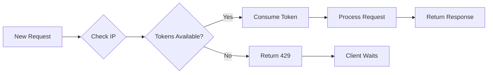

## Overview

Iris implements **per-IP rate limiting** using the `governor` crate to prevent abuse, ensure fair resource allocation, and protect against denial-of-service attacks. The rate limiter operates entirely in memory with no persistent storage.

## Rate Limit Configuration

### Default Limits

The API enforces the following limits per IP address:

- **Sustained rate**: 5 requests per second
- **Burst capacity**: Up to 10 requests
- **Rejection response**: HTTP 429 Too Many Requests

```rust
// From main.rs:127-130
// 5 requests/second per IP, burst up to 10
let quota = Quota::per_second(NonZeroU32::new(5).unwrap())
    .allow_burst(NonZeroU32::new(10).unwrap());
let limiter: SharedRateLimiter = Arc::new(RateLimiter::keyed(quota));
```

<Info>
The burst capacity allows for occasional spikes in traffic while maintaining an average rate of 5 req/s over time.
</Info>

## How It Works

### Token Bucket Algorithm

Iris uses the **token bucket algorithm** implemented by the `governor` crate:

1. Each IP address starts with 10 tokens (burst capacity)
2. Tokens refill at a rate of 5 per second
3. Each request consumes 1 token
4. When tokens are exhausted, requests are rejected with HTTP 429



### Middleware Implementation

Rate limiting is enforced via Axum middleware that runs before request handlers:

```rust
// From main.rs:35-45
async fn rate_limit_middleware(
    State(state): State<AppState>,
    ConnectInfo(addr): ConnectInfo<SocketAddr>,
    request: Request,
    next: Next,
) -> Response {
    if state.limiter.check_key(&addr.ip()).is_err() {
        return StatusCode::TOO_MANY_REQUESTS.into_response();
    }
    next.run(request).await
}
```

**Key characteristics:**
- Runs before any request processing
- Extracts client IP from socket connection
- Checks rate limit atomically
- Returns 429 immediately if limit exceeded
- Passes request to handler if within limits

### Application Integration

The rate limiter is applied globally to all routes:

```rust
// From main.rs:143-149
let app = Router::new()
    .route("/compare", post(handle_compare))
    .route("/stats", get(handle_stats))
    .route("/health", get(|| async { "OK" }))
    .layer(middleware::from_fn_with_state(state.clone(), rate_limit_middleware))
    .layer(cors)
    .with_state(state);
```

<Note>
All endpoints including `/compare`, `/stats`, and `/health` are subject to rate limiting.
</Note>

## Rate Limit Behavior

### Successful Request Flow

```bash
# First request (burst available)
curl -X POST http://localhost:8080/compare \
  -H "Content-Type: application/json" \
  -d '{...}'
# Response: 200 OK

# Immediate second request (burst available)
curl -X POST http://localhost:8080/compare \
  -H "Content-Type: application/json" \
  -d '{...}'
# Response: 200 OK
```

### Rate Limit Exceeded

```bash
# After exhausting burst capacity (10+ rapid requests)
curl -X POST http://localhost:8080/compare \
  -H "Content-Type: application/json" \
  -d '{...}'
# Response: 429 Too Many Requests
```

<Warning>
When you receive a 429 response, the API provides no response body or retry-after header. Clients should implement exponential backoff.
</Warning>

## Rate Limit State Management

The rate limiter is stored in shared application state:

```rust
// From main.rs:26-33
type SharedRateLimiter = Arc<RateLimiter<IpAddr, DefaultKeyedStateStore<IpAddr>, DefaultClock>>;

#[derive(Clone)]
struct AppState {
    engine: Arc<Mutex<FaceEngine>>,
    limiter: SharedRateLimiter,  // Shared across all request handlers
    stats: RequestStats,
}
```

**Thread safety:**
- `Arc` provides shared ownership across async tasks
- `governor` uses lock-free algorithms internally
- Multiple requests can check limits concurrently
- State is keyed by `IpAddr` for per-IP tracking

## IP Address Extraction

The client IP is extracted from the TCP connection:

```rust
ConnectInfo(addr): ConnectInfo<SocketAddr>
// addr.ip() returns the IpAddr (IPv4 or IPv6)
```

<Warning>
**Proxy Considerations**: If Iris is deployed behind a reverse proxy (nginx, Cloudflare, etc.), the rate limiter will see the proxy's IP address, not the client's IP. See [Proxy Configuration](#proxy-configuration) below.
</Warning>

## Configuring Custom Rate Limits

To modify the rate limits, edit the quota configuration in `main.rs`:

### Change Sustained Rate

```rust
// Allow 10 requests per second instead of 5
let quota = Quota::per_second(NonZeroU32::new(10).unwrap())
    .allow_burst(NonZeroU32::new(20).unwrap());
```

### Change Time Window

```rust
// Allow 60 requests per minute (1 per second sustained)
let quota = Quota::per_minute(NonZeroU32::new(60).unwrap())
    .allow_burst(NonZeroU32::new(10).unwrap());
```

### Remove Burst Capacity

```rust
// Strict 5 req/s with no burst
let quota = Quota::per_second(NonZeroU32::new(5).unwrap());
// No allow_burst() call = burst size equals sustained rate
```

### Per-Route Rate Limits

To apply different limits to different endpoints, create multiple middleware instances:

```rust
// Create separate limiters
let strict_limiter = Arc::new(RateLimiter::keyed(
    Quota::per_second(NonZeroU32::new(1).unwrap())
));
let lenient_limiter = Arc::new(RateLimiter::keyed(
    Quota::per_second(NonZeroU32::new(100).unwrap())
));

// Apply to specific routes
let app = Router::new()
    .route("/compare", post(handle_compare))
        .layer(middleware::from_fn_with_state(strict_state, rate_limit_middleware))
    .route("/health", get(health))
        .layer(middleware::from_fn_with_state(lenient_state, rate_limit_middleware));
```

## Proxy Configuration

When deployed behind a reverse proxy, configure the proxy to forward the real client IP:

### Nginx

```nginx
location / {
    proxy_pass http://localhost:8080;
    proxy_set_header X-Real-IP $remote_addr;
    proxy_set_header X-Forwarded-For $proxy_add_x_forwarded_for;
}
```

Then modify Iris to read from the `X-Forwarded-For` header instead of `ConnectInfo`:

```rust
use axum::http::HeaderMap;

async fn rate_limit_middleware(
    State(state): State<AppState>,
    headers: HeaderMap,
    request: Request,
    next: Next,
) -> Response {
    let ip = headers
        .get("X-Forwarded-For")
        .and_then(|h| h.to_str().ok())
        .and_then(|s| s.split(',').next())
        .and_then(|s| s.trim().parse::<IpAddr>().ok())
        .unwrap_or_else(|| "127.0.0.1".parse().unwrap());
    
    if state.limiter.check_key(&ip).is_err() {
        return StatusCode::TOO_MANY_REQUESTS.into_response();
    }
    next.run(request).await
}
```

<Warning>
**Security Risk**: Only read `X-Forwarded-For` if you trust the proxy. Malicious clients can spoof this header to bypass rate limiting.
</Warning>

## Cloudflare Integration

If using Cloudflare, use the `CF-Connecting-IP` header:

```rust
let ip = headers
    .get("CF-Connecting-IP")
    .and_then(|h| h.to_str().ok())
    .and_then(|s| s.parse::<IpAddr>().ok())
    .unwrap_or_else(|| "127.0.0.1".parse().unwrap());
```

## Monitoring Rate Limits

### Check Current Rate Limit Status

The rate limiter state is in-memory only. To observe rate limiting:

1. **Monitor 429 responses** in your reverse proxy logs
2. **Track response status codes** in your application metrics
3. **Implement custom middleware** to expose rate limit headers

### Add Rate Limit Headers

To help clients understand their limits, add response headers:

```rust
async fn rate_limit_middleware(
    State(state): State<AppState>,
    ConnectInfo(addr): ConnectInfo<SocketAddr>,
    request: Request,
    next: Next,
) -> Response {
    match state.limiter.check_key(&addr.ip()) {
        Ok(_) => {
            let mut response = next.run(request).await;
            response.headers_mut().insert(
                "X-RateLimit-Limit",
                "5".parse().unwrap()
            );
            response
        }
        Err(_) => {
            let mut response = StatusCode::TOO_MANY_REQUESTS.into_response();
            response.headers_mut().insert(
                "Retry-After",
                "1".parse().unwrap()
            );
            response
        }
    }
}
```

## Performance Characteristics

- **Memory usage**: O(n) where n = number of unique IPs in the time window
- **Lookup speed**: O(1) constant time per request
- **Lock contention**: Minimal (lock-free algorithm)
- **Overhead**: ~10-50 microseconds per request

<Info>
The rate limiter automatically prunes expired entries, so memory usage remains bounded even with millions of IPs over time.
</Info>

## Testing Rate Limits

### Load Testing Script

```bash
#!/bin/bash
# test-rate-limit.sh

for i in {1..15}; do
  echo "Request $i"
  curl -w "Status: %{http_code}\n" \
    -X POST http://localhost:8080/compare \
    -H "Content-Type: application/json" \
    -d '{
      "target_url": "https://example.com/face.jpg",
      "people": []
    }' &
done
wait
```

**Expected output:**
- First 10 requests: HTTP 200 (burst capacity)
- Remaining 5 requests: HTTP 429 (rate limited)

### Apache Bench

```bash
ab -n 100 -c 10 -p request.json -T application/json \
  http://localhost:8080/compare
```

Monitor the number of `Non-2xx responses` to see rate limiting in action.

## Comparison with Alternative Approaches

| Approach | Pros | Cons |
|----------|------|------|
| **IP-based (current)** | Simple, no client setup, works immediately | Can't distinguish users behind NAT |
| **API key-based** | Per-user limits, better for commercial use | Requires authentication layer |
| **Token bucket (current)** | Allows bursts, fair over time | Complex to explain to users |
| **Fixed window** | Easy to understand | Vulnerable to burst attacks at window boundaries |
| **Sliding window** | More accurate rate enforcement | Higher memory usage |

## Frequently Asked Questions

**Q: Why am I getting 429 errors when I'm only making a few requests?**

A: If behind a proxy/NAT, multiple users may share the same IP address. Consider implementing API key-based rate limiting.

**Q: Can I disable rate limiting for testing?**

A: Yes, set an extremely high quota:
```rust
let quota = Quota::per_second(NonZeroU32::new(1_000_000).unwrap());
```

**Q: Does rate limiting persist across server restarts?**

A: No. Rate limit state is in-memory only and resets when the server restarts.

**Q: How do I implement whitelisted IPs?**

A: Add a check in the middleware:
```rust
let whitelisted = ["192.168.1.100".parse().unwrap()];
if whitelisted.contains(&addr.ip()) {
    return next.run(request).await;
}
```

**Q: What happens to the rate limit when I scale horizontally?**

A: Each instance has independent rate limit state. Consider using Redis-based rate limiting for distributed deployments.

## Related Documentation

- [Privacy Model](/security/privacy-model) - Understanding data handling
- [CORS Configuration](/security/cors) - Cross-origin access control
- [Deployment Guide](/deploy/docker) - Production deployment best practices